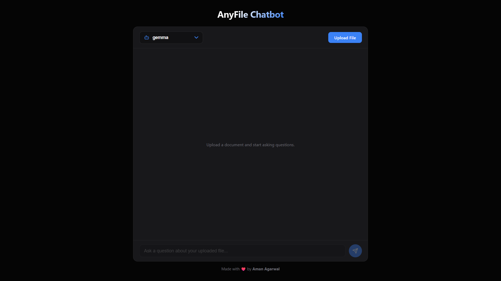
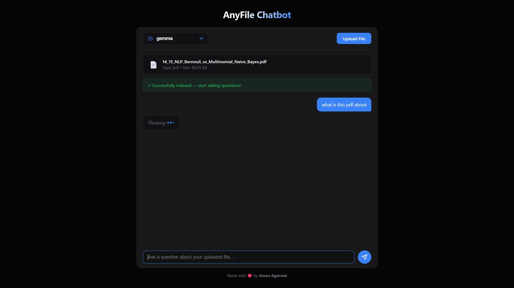
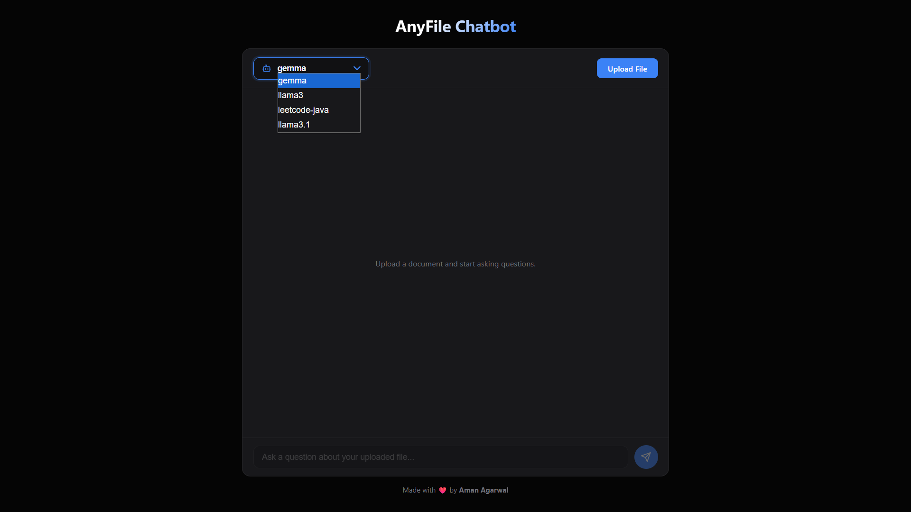

# 🤖 AnyFile Chatbot

> **Intelligent document Q&A powered by AI** - Upload PDFs, DOCX, or XLSX files and chat with your documents using advanced language models.


<!-- Add your demo GIF here -->

---

## ✨ Features

- 📄 **Multi-Format Support** - Works with PDF, Word (DOCX), and Excel (XLSX) files
- 🤖 **Multiple AI Models** - Choose from LLaMA 3, Gemma, and other Ollama models
- ⚡ **Real-Time Processing** - Live progress tracking with animated status updates
- 💬 **Natural Conversations** - Typing animations and smooth chat experience
- 🎨 **Modern UI/UX** - Clean, dark-themed interface inspired by professional SaaS apps
- 🔍 **Context-Aware** - Uses vector embeddings and semantic search for accurate answers
- 🚀 **Fast & Efficient** - Optimized chunking and caching for quick responses

---

## 🖼️ Screenshots

### Main Interface

<!-- Add main interface screenshot -->

### File Upload & Processing

<!-- Add upload/processing screenshot -->

### Chat Interaction

<!-- Add chat conversation screenshot -->

### Model Selection

<!-- Add model dropdown screenshot -->

---

## 🛠️ Tech Stack

**Backend:**
- Flask (Python web framework)
- LangChain (LLM orchestration)
- Ollama (Local AI models)
- FAISS (Vector similarity search)
- PyPDF, python-docx, pandas (Document parsing)

**Frontend:**
- Vanilla JavaScript (ES6+)
- Modern CSS with CSS Variables
- Server-Sent Events (SSE) for real-time updates

---

## 📦 Installation

### Prerequisites
- Python 3.8+
- [Ollama](https://ollama.ai) installed and running
- At least one AI model pulled (e.g., `ollama pull llama3`)

### Setup Steps

1. **Clone the repository**
```bash
git clone https://github.com/agarwalaman598/chatbot-anyfile.git
cd chatbot-anyfile
```

2. **Create virtual environment**
```bash
python -m venv venv

# Windows
venv\Scripts\activate

# macOS/Linux
source venv/bin/activate
```

3. **Install dependencies**
```bash
pip install -r requirements.txt
```

4. **Start Ollama** (in a separate terminal)
```bash
ollama serve
```

5. **Pull AI models** (if not already done)
```bash
ollama pull llama3
ollama pull gemma
```

6. **Run the application**
```bash
python app.py
```

7. **Open in browser**
```
http://localhost:5000
```

---

## 🚀 Usage

1. **Select AI Model** - Choose your preferred model from the dropdown (top-left)
2. **Upload File** - Click "Upload File" and select a PDF, DOCX, or XLSX document
3. **Wait for Indexing** - Watch the circular progress indicator as your file is processed
4. **Start Chatting** - Once indexed, type your question in the input box
5. **Get Answers** - The AI will respond based on the content of your uploaded document

---

## 🎯 How It Works

1. **Document Processing**
   - Extracts text from uploaded files (PDF/DOCX/XLSX)
   - Splits text into semantic chunks (1000 chars with 100 overlap)

2. **Vector Embedding**
   - Creates embeddings using Ollama's embedding models
   - Stores in FAISS vector database for fast similarity search

3. **Query Processing**
   - Searches for relevant document chunks using semantic similarity
   - Constructs context-aware prompts for the LLM

4. **Response Generation**
   - Streams responses with typing animation
   - Maintains conversation context

---

## 📁 Project Structure

```
chatbot-anyfile/
├── app.py                      # Flask backend
├── requirements.txt            # Python dependencies
├── uploads/                    # Uploaded files storage
├── frontend/
│   ├── templates/
│   │   └── index.html         # Main HTML template
│   └── static/
│       ├── css/
│       │   └── style.css      # Styling
│       └── js/
│           └── app.js         # Frontend logic
└── assets/                    # Screenshots & media (add your images here)
    ├── demo.gif
    ├── screenshot-main.png
    ├── screenshot-upload.png
    ├── screenshot-chat.png
    └── screenshot-models.png
```

---

## 🔧 Configuration

### Supported File Types
- **PDF** - Multi-page document support with page-by-page extraction
- **DOCX** - Microsoft Word documents
- **XLSX** - Excel spreadsheets (all sheets combined)

### Performance Tuning
Adjust these constants in `app.py`:
```python
CHUNK_SIZE = 1000        # Text chunk size for embeddings
CHUNK_OVERLAP = 100      # Overlap between chunks
MAX_FILE_SIZE = 50 MB    # Maximum upload size
```

---

## 🌐 Deployment

### Free Deployment Options

#### Option 1: Render + Hugging Face API (Fully Cloud)
See [DEPLOYMENT.md](./DEPLOYMENT.md) for detailed instructions.

#### Option 2: PythonAnywhere
1. Sign up at [pythonanywhere.com](https://www.pythonanywhere.com)
2. Upload code or clone from GitHub
3. Configure WSGI to point to `app.py`
4. Install dependencies and reload

#### Option 3: Local + ngrok (For Demo)
```bash
# Run app locally
python app.py

# In another terminal
ngrok http 5000
```

---

## 🐛 Troubleshooting

**Issue**: Models not loading
- **Solution**: Ensure Ollama is running (`ollama serve`) and models are pulled

**Issue**: Slow processing
- **Solution**: Reduce `CHUNK_SIZE` or switch to a smaller model like `gemma`

**Issue**: "Vector store not created"
- **Solution**: Check file format is supported and Ollama embeddings are working

**Issue**: Chat not responding
- **Solution**: Verify file was successfully indexed (green success banner should appear)

---

## 🤝 Contributing

Contributions are welcome! Here's how:

1. Fork the repository
2. Create a feature branch (`git checkout -b feature/AmazingFeature`)
3. Commit changes (`git commit -m 'Add some AmazingFeature'`)
4. Push to branch (`git push origin feature/AmazingFeature`)
5. Open a Pull Request

---

## 📝 License

This project is licensed under the MIT License - see the [LICENSE](LICENSE) file for details.

---

## 👨‍💻 Author

**Aman Agarwal**

- GitHub: [@agarwalaman598](https://github.com/agarwalaman598)
- Repository: [chatbot-anyfile](https://github.com/agarwalaman598/chatbot-anyfile)

---

## 🙏 Acknowledgments

- [Ollama](https://ollama.ai) for local AI model infrastructure
- [LangChain](https://langchain.com) for LLM orchestration framework
- [FAISS](https://github.com/facebookresearch/faiss) for efficient similarity search
- [Flask](https://flask.palletsprojects.com/) for the web framework

---

## 📊 Project Stats


---

<p align="center">Made with ❤️ by Aman Agarwal</p>